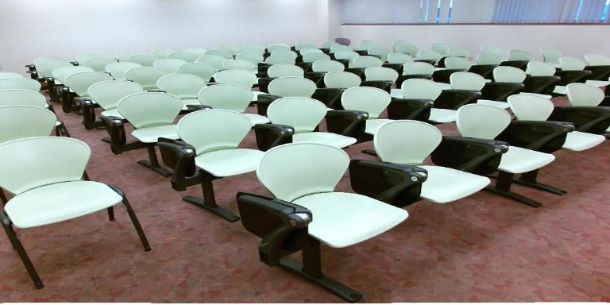

# AdapNet:  Adaptive  Semantic  Segmentation in  Adverse  Environmental  Conditions
AdapNet is a deep learning model for semantic image segmentation, where the goal is to assign semantic labels to every
pixel in the input image. 

This repository contains our TensorFlow implementation. We provide codes allowing users to train the model, evaluate
results in terms of mIoU(mean intersection-over-union). 

If you find the code useful for your research, please consider citing our paper:
```
@inproceedings{valada2017icra,
author = "Abhinav Valada and Johan Vertens and Ankit Dhall and Wolfram Burgard",
title = "AdapNet: Adaptive Semantic Segmentation in Adverse Environmental Conditions",
booktitle = "Proceedings of the IEEE International Conference on Robotics and Automation (ICRA)",
month = "May",
year = "2017",
}
```

## Some segmentation results:

| Dataset       | RGB_Image     | Segmented_Image|
| ------------- | ------------- | -------------  |
| Cityscapes    | |  |
| Forest  |   | |
| Sun  |   | |
| Synthia  |   |  |
| Scannetv2  |   | |
## System requirement

#### Programming language
```
Python 2.7
```
#### Python Packages
```
tensorflow-gpu 1.4.0
```
## Configure the network

Download resnet_v1_50 tensorflow pre-trained model for network intialization from [here](https://github.com/tensorflow/models/tree/master/research/slim).

#### Training
```
    gpu_id: id of gpu to be used
    model: name of the model
    num_classes: number of classes
    intialize:  path to pre-trained model
    checkpoint: path to save model
    train_data: path to dataset .tfrecords
    dataset: name of dataset (cityscapes, forest, scannet, synthia or sun)
    batch_size: training batch size
    type: type of data  (rgb, jet(depth), hha(depth))
    skip_step: how many steps to print loss 
    height: height of input image
    width: width of input image
    max_iteration: how many iterations to train
    learning_rate: initial learning rate
    save_step: how many steps to save the model
    power: parameter for poly learning rate
    mean: path to mean file 
```
#### Evaluation
```
    gpu_id: id of gpu to be used
    model: name of the model
    num_classes: number of classes
    checkpoint: path to saved model
    test_data: path to dataset .tfrecords
    dataset: name of dataset (cityscapes, forest, scannet, synthia or sun)
    batch_size: evaluation batch size
    type: type of data  (rgb, jet(depth), hha(depth))
    skip_step: how many steps to print mIoU
    height: height of input image
    width: width of input image
    mean: path to mean file 
```
#### Data
```
Augment the default dataset -> augmented-dataset.
Convert it into .tfrecords format. (Use features identical to the one given in dataset/helper.py parser function)
             
(Input to model is in BGR and 'NHWC' form)

```
## Training and Evaluation

#### Start training
Create the config file for training in config folder.
Run
```
python train.py -c config cityscapes_train.config or python train.py --config cityscapes_train.config

```

#### Eval

Select a checkpoint to test/validate your model in terms of mean IoU.
Create the config file for evaluation in config folder.

```
python evaluate.py -c config cityscapes_test.config or python evaluate.py --config cityscapes_test.config
```


