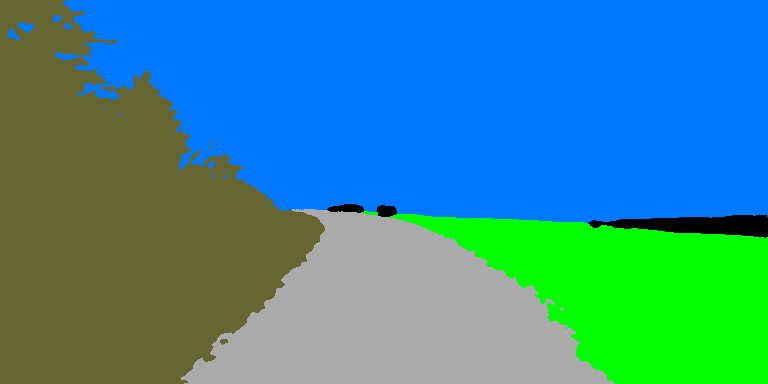
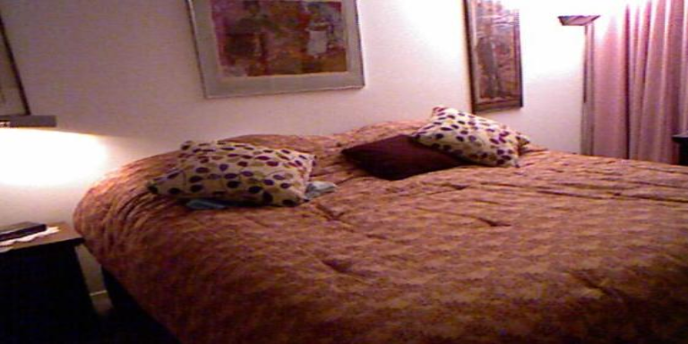
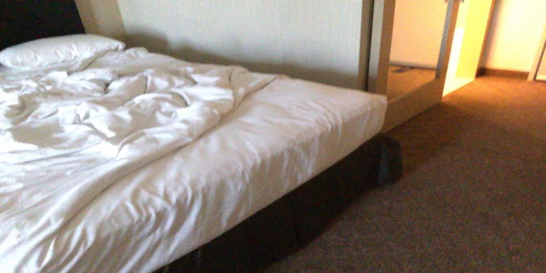

# AdapNet:  Adaptive  Semantic  Segmentation in  Adverse  Environmental  Conditions
AdapNet is a deep learning model for semantic image segmentation, where the goal is to assign semantic labels (e.g., car, road, tree and so on) to every pixel in the input image. AdapNet is easily trainable on a single GPU with 12 GB of memory and has a fast inference time. AdapNet is benchmarked on Cityscapes, Synthia, ScanNet, SUN RGB-D and Freiburg Forest datasets.

This repository contains our TensorFlow implementation of AdapNet which allows you to train your own model on any dataset and evaluate the results in terms of the mean IoU metric.

Adapnet can further be used with [CMODE](https://github.com/DeepSceneSeg/CMoDE) or [SSMA](https://github.com/DeepSceneSeg/SSMA) fusion schemes for multimodal semantic segmentation.

If you find the code useful for your research, please consider citing our paper:
```
@inproceedings{valada2017icra,
author = {Valada, Abhinav and Vertens, Johan and Dhall, Ankit and Burgard, Wolfram},
title = {AdapNet: Adaptive Semantic Segmentation in Adverse Environmental Conditions},
booktitle = {Proceedings of the IEEE International Conference on Robotics and Automation (ICRA)},
pages={4644--4651},
year = {2017},
organization={IEEE}
}
```
## Live Demo
http://deepscene.cs.uni-freiburg.de

## Example Segmentation Results

| Dataset       | RGB_Image     | Segmented_Image|
| ------------- | ------------- | -------------  |
| Cityscapes    | |  |
| Forest  |   | |
| Sun RGB-D  |   | |
| Synthia  |   |  |
| ScanNet v2  |   | |

## Contacts
* [Abhinav Valada](http://www2.informatik.uni-freiburg.de/~valada/)
* [Rohit Mohan](https://github.com/mohan1914)

## System Requirements

#### Programming language
```
Python 2.7
```
#### Python Packages
```
tensorflow-gpu 1.4.0
```
## Configure the Network

Download the resnet_v1_50 tensorflow pre-trained model for network intialization from [here](https://github.com/tensorflow/models/tree/master/research/slim).

#### Data

* Augment the training data.
  In our work, we first resized the images in the dataset to 768x384 pixels and then apply a series of augmentations (random_flip, random_scale and random_crop).

* Convert the training data (augmented), test data and validation data into the .tfrecords format.
  Create a .txt file for each set having entries in the following format:
  ```
     path_to_modality1/0.png path_to_label/0.png
     path_to_modality1/1.png path_to_label/1.png
     path_to_modality1/2.png path_to_label/2.png
     ...
  ```
  Run the convert_to_tfrecords.py from dataset folder for each of the train, test, val sets to create the tfrecords and the mean '.npy' file. The mean file should be only created for the train set.
  ```
     python convert_to_tfrecords.py --file path_to_.txt_file --record tf_records_name.tfrecords --mean True
  ```
  (Input to the model is in BGR and 'NHWC' form)

#### Training
```
    gpu_id: id of gpu to be used
    model: name of the model
    num_classes: number of classes
    intialize:  path to pre-trained model
    checkpoint: path to save model
    train_data: path to dataset .tfrecords
    batch_size: training batch size
    skip_step: how many steps to print loss 
    height: height of input image
    width: width of input image
    max_iteration: how many iterations to train
    learning_rate: initial learning rate
    save_step: how many steps to save the model
    power: parameter for poly learning rate
    mean: path to mean file 
```
#### Evaluation
```
    gpu_id: id of gpu to be used
    model: name of the model
    num_classes: number of classes
    checkpoint: path to saved model
    test_data: path to dataset .tfrecords
    batch_size: evaluation batch size
    skip_step: how many steps to print mIoU
    height: height of input image
    width: width of input image
    mean: path to mean file 
```
## Training and Evaluation

#### Training
Edit the config file for training in config folder.
Run:
```
python train.py -c config cityscapes_train.config or python train.py --config cityscapes_train.config
```

#### Evaluation

Select a checkpoint to test/validate your model in terms of the mean IoU metric.
Edit the config file for evaluation in config folder. Run:

```
python evaluate.py -c config cityscapes_test.config or python evaluate.py --config cityscapes_test.config
```
## Additional Notes:
   * We only provide the single scale evaluation script. Multi-Scale+Flip evaluation further imporves the performance of the model.
   * The code in this repository only performs training on a single GPU. Multi-GPU training using synchronized batch normalization with larger batch size furthur improves the performance of the model.
   * Initializing the model with pre-trained weights from large datasets such as the Mapillary Vistas and BDD100K yields an improved performance.
   
## License
For academic usage, the code is released under the [GPLv3](https://www.gnu.org/licenses/gpl-3.0.en.html) license. For any commercial purpose, please contact the authors.
